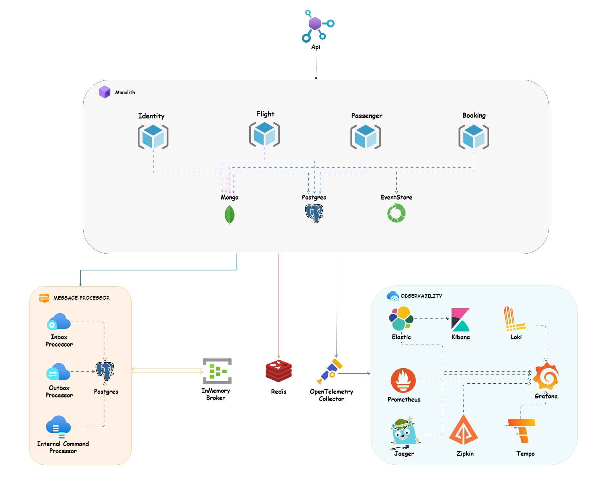

# 🪁 Monolith Architecture Style

> In **Monolith Architecture**, the entire application is built as a single, tightly coupled unit. All components (e.g., Api, business logic, and data access) are part of the same codebase and deployed together.

# Table of Contents

- [Key Features](#key-features)
- [When to Use](#when-to-use)
- [Challenges](#challenges)
- [Monolith Architecture Design](#monolith-architecture-design)
- [Development Setup](#development-setup)
    - [Dotnet Tools Packages](#dotnet-tools-packages)
    - [Husky](#husky)
    - [Upgrade Nuget Packages](#upgrade-nuget-packages)
- [How to Run](#how-to-run)
  - [Build](#build)
  - [Run](#run)
  - [Test](#test)
- [Documentation Apis](#documentation-apis)


## Key Features
1. **Single Codebase**: All components (UI, business logic, data access) are part of one project.
2. **Tight Coupling**: Components are highly dependent on each other, making changes riskier.
3. **Simple Deployment**: The entire application is deployed as a single unit.
4. **Centralized Database**: Typically uses a single database for all data storage and access.


## When to Use
1. **Small to Medium Projects**: Ideal for applications with limited complexity and scope.
2. **Rapid Development**: Suitable for projects requiring quick development and deployment.
3. **Small Teams**: Works well for small teams with limited resources.
4. **Low Scalability Needs**: Best for applications with predictable and low traffic.


## Challenges
- Harder to maintain as the codebase grows.
- Limited scalability (scaling requires scaling the entire application).
- Difficult to adopt new technologies incrementally.

## Monolith Architecture Design




## Development Setup

### Dotnet Tools Packages
For installing our requirement packages with .NET cli tools, we need to install `dotnet tool manifest`.
```bash
dotnet new tool-manifest
```
And after that we can restore our dotnet tools packages with .NET cli tools from `.config` folder and `dotnet-tools.json` file.
```
dotnet tool restore
```

### Husky
Here we use `husky` to handel some pre commit rules and we used `conventional commits` rules and `formatting` as pre commit rules, here in [package.json](.././package.json). of course, we can add more rules for pre commit in future. (find more about husky in the [documentation](https://typicode.github.io/husky/get-started.html))
We need to install `husky` package for `manage` `pre commits hooks` and also I add two packages `@commitlint/cli` and `@commitlint/config-conventional` for handling conventional commits rules in [package.json](.././package.json).
Run the command bellow in the root of project to install all npm dependencies related to husky:

```bash
npm install
```

> Note: In the root of project we have `.husky` folder and it has `commit-msg` file for handling conventional commits rules with provide user friendly message and `pre-commit` file that we can run our `scripts` as a `pre-commit` hooks. that here we call `format` script from [package.json](./package.json) for formatting purpose.

### Upgrade Nuget Packages
For upgrading our nuget packages to last version, we use the great package [dotnet-outdated](https://github.com/dotnet-outdated/dotnet-outdated).
Run the command below in the root of project to upgrade all of packages to last version:
```bash
dotnet outdated -u
```

## How to Run

> ### Build
To `build` monolith app, run this command in the `root` of the project:
```bash
dotnet build
```

> ### Run
To `run` monolith app, run this command in the root of the `Api` folder where the `csproj` file is located:
```bash
dotnet run
```

> ### Test

To `test` monolith app, run this command in the `root` of the project:
```bash
dotnet test
```

> ### Documentation Apis

Each microservice provides `API documentation` and navigate to `/swagger` for `Swagger OpenAPI` or `/scalar/v1` for `Scalar OpenAPI` to visit list of endpoints.

As part of API testing, I created the [booking.rest](./booking.rest) file which can be run with the [REST Client](https://github.com/Huachao/vscode-restclient) `VSCode plugin`.
